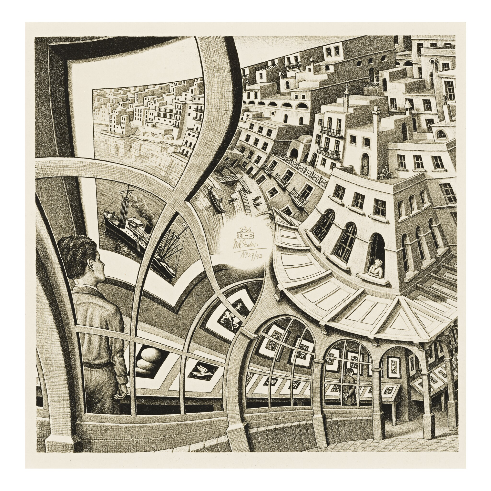
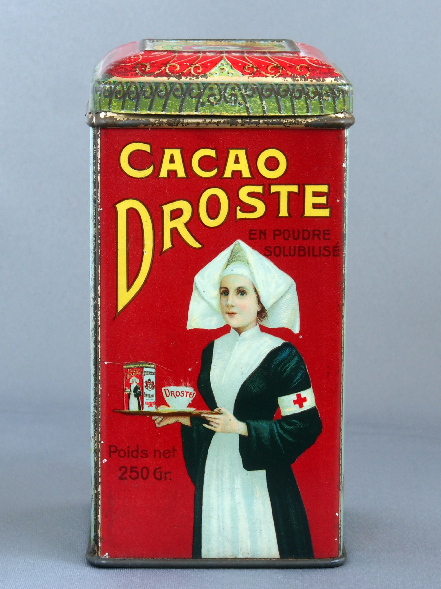

# Escher-Droste torus twist

The following two pictures are similar
in that each of them is contained in itself in a sense.

I want to understand this similarity more precisely,
and I think it has to do with twisting a torus.

## Result

